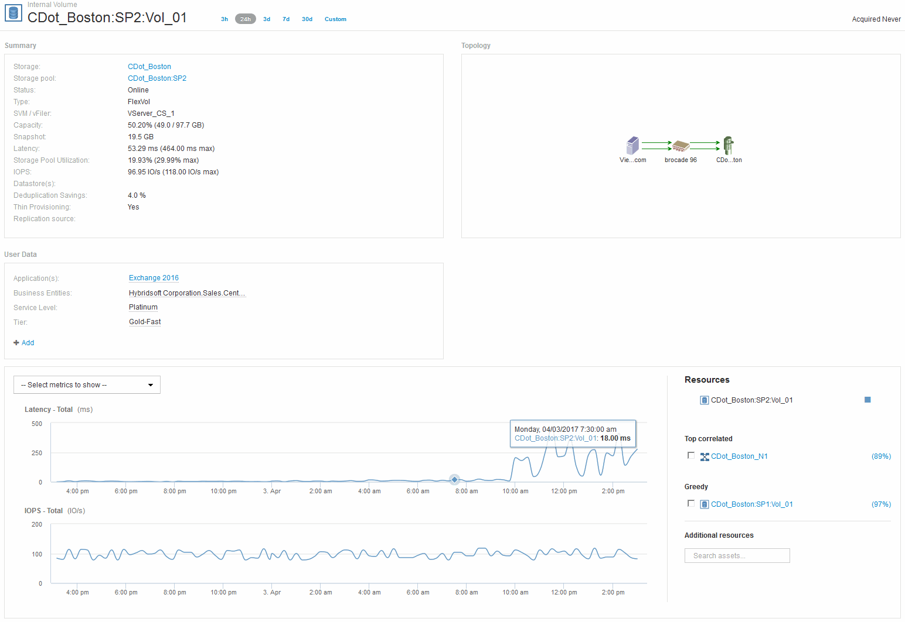
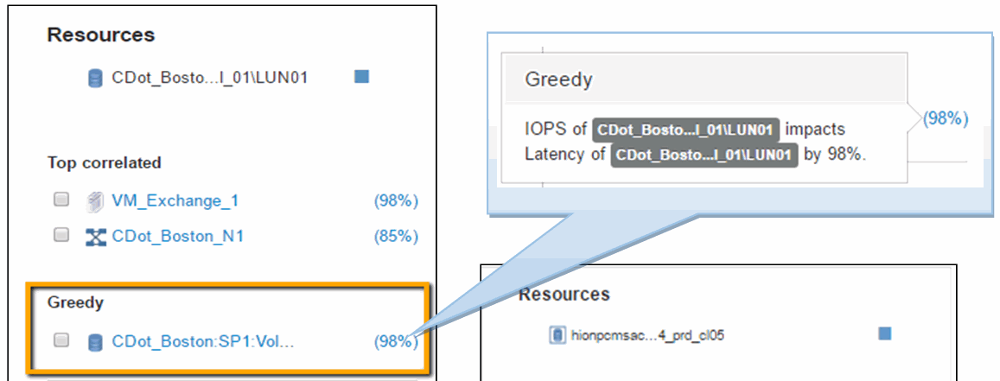
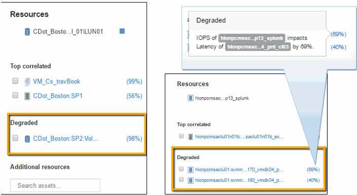

= 檢查內部磁碟區
:allow-uri-read: 
:icons: font
:imagesdir: ../media/

在「內部Volume」登陸頁面中、您會看到：

* 內部磁碟區的效能圖表與先前在延遲和IOPS方面的應用程式效能相符。
* 在顯示關聯資產的「Resources（資源）」區段中、會識別出「'greede'（資源）」資源（CDot_波士頓：SP1：Vol _01）。

深入分析關聯分析可識別出一種貪多的資源。貪婪/降級的資源是使用相同共享資源的「對等資源」。資源的使用率或IOPS會對降級資源的IOPS或延遲造成負面影響。

可在虛擬機器、Volume和內部Volume登陸頁面上識別貪貪貪資源和降級資源。每個登陸頁最多會顯示兩個貪資源。

選取關聯排名（%）可提供更多資源分析結果。例如、按一下「佔用百分比」值、即可識別影響降級資產作業的資產作業、類似於下列範例所示。

當識別出降級資源時、您可以選取降級（%）分數、以識別影響降級資源的作業和資源。

