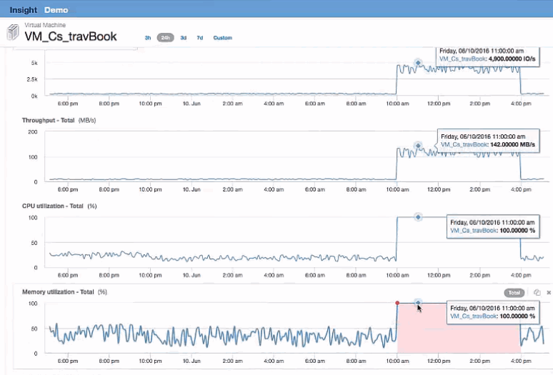
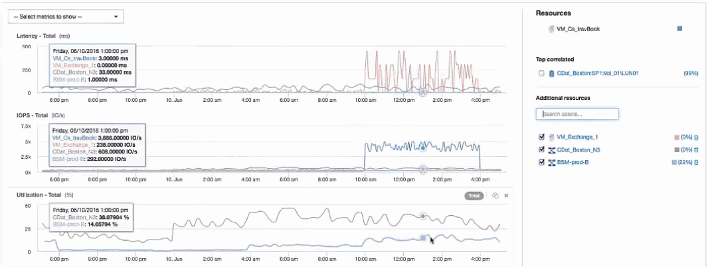

= 檢查VM
:allow-uri-read: 
:icons: font
:imagesdir: ../media/

[role="lead"]
在VM登陸頁面中、選取要顯示的其他度量、並包含CPU使用率和記憶體使用率。CPU與記憶體使用率的圖表顯示、兩者的運作速度幾乎達到其容量的100%。這告訴我們Exchange伺服器的問題不是儲存問題、而是VM CPU和記憶體使用率高、以及I/O與磁碟之間的記憶體交換量。

若要解決此問題、您可以尋找其他類似資源。在其他資源輸入對話方塊中輸入「'Node"（節點）、以顯示類似Exchange VM的資產度量。比較有助於找出一個節點、以便在需要變更時更適合裝載工作負載。

