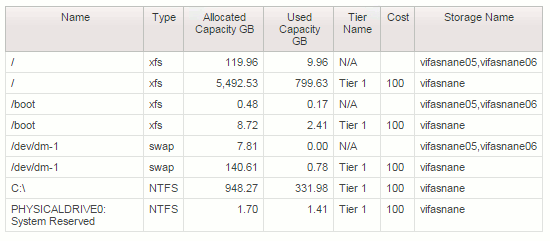

= 檔案系統計費與報告
:allow-uri-read: 
:icons: font
:imagesdir: ../media/

[role="lead"]
檔案系統的計費作業一律從儲存層面執行。與為特定運算資源群組註釋的虛擬機器相關聯的儲存陣列、將會納入該資源群組的計費報告中。

== 開始之前

您想要納入檔案系統使用率計費的任何虛擬機器、都必須以適當的運算資源群組名稱加以註釋。與這些虛擬機器相關聯的儲存陣列必須加上適當的階層註釋。必須在這些註釋準備就緒之後、才會發生ETL到資料倉儲的情況。

== 步驟

. 通常、請開啟瀏覽器至您的報告伺服器 `https://<host or IP>:9300/p2pd``http://<host or IP\>:9300/bi (7.3.3 or later)` 並登入。
. 選擇*檔案系統使用率*套件、然後建立新報告。
+
image::../media/fs-util-pkg.gif[FS工具包]

. 從資料倉儲拖放項目、以建立報告。
+
以下範例是非常簡單的報告。您可以根據自己的特定業務需求建立複雜的報告。

+

