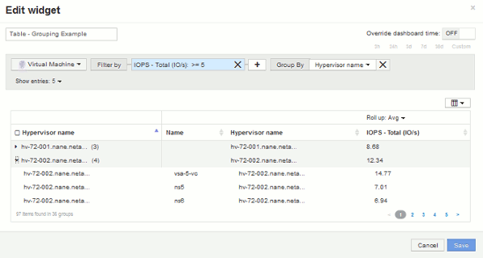

= 分組範例（說明彙總）
:allow-uri-read: 
:icons: font
:imagesdir: ../media/

[role="lead"]
表格小工具可讓您將資料分組、以便更輕鬆地顯示。

== 關於這項工作

在此範例中、我們將建立一個表格小工具、顯示依資料中心分組的所有VM。

== 步驟

. 建立或開啟儀表板、然後新增*表格*小工具。
. 選取*虛擬機器*作為此Widget的資產類型。
. 按一下「欄選取器」  並選擇_Hypervisor名稱_和_IOPS -總計_。
+
這些欄現在會顯示在表格中。

. 讓我們忽略任何沒有IOPS的VM、只包括總IOPS大於1的VM。按一下「*篩選依據+*」按鈕、然後選取「* IOPS -總計*」。按一下* any *、然後在* from *（*來源*）欄位中輸入1。將*收件人*欄位保留空白。按一下核取按鈕以套用篩選條件。
+
此表現在顯示所有IOPS總計大於或等於1的VM。請注意、表格中沒有任何群組。顯示所有VM。

. 點擊* Group by +*（按+*分組）按鈕。
+
由於* All *預設為群組方法、因此所有VM都會移到名為「All」的單一群組中。

. 在_IOPS - Total（總IOPS）欄位上方、現在是* Roll up*（彙總*）選項。預設的彙總方法為_Avg_。也就是說、顯示給群組的數字是群組內每個VM所報告的所有IOPS總計平均值。您可以選擇依_Avg_、_Sum_、_min_或_Max_將此欄向上捲動。您所顯示的每個包含效能指標的欄都可以個別彙總。
. 按一下*全部*並選取* Hypervisor名稱*。
+
虛擬機器清單現在會依Hypervisor分組。您可以擴充每個Hypervisor、以檢視由其託管的VM。

+

. 按一下「*儲存*」將表格儲存至儀表板。您可以調整小工具的大小。
. 按一下「*儲存*」以儲存儀表板。

