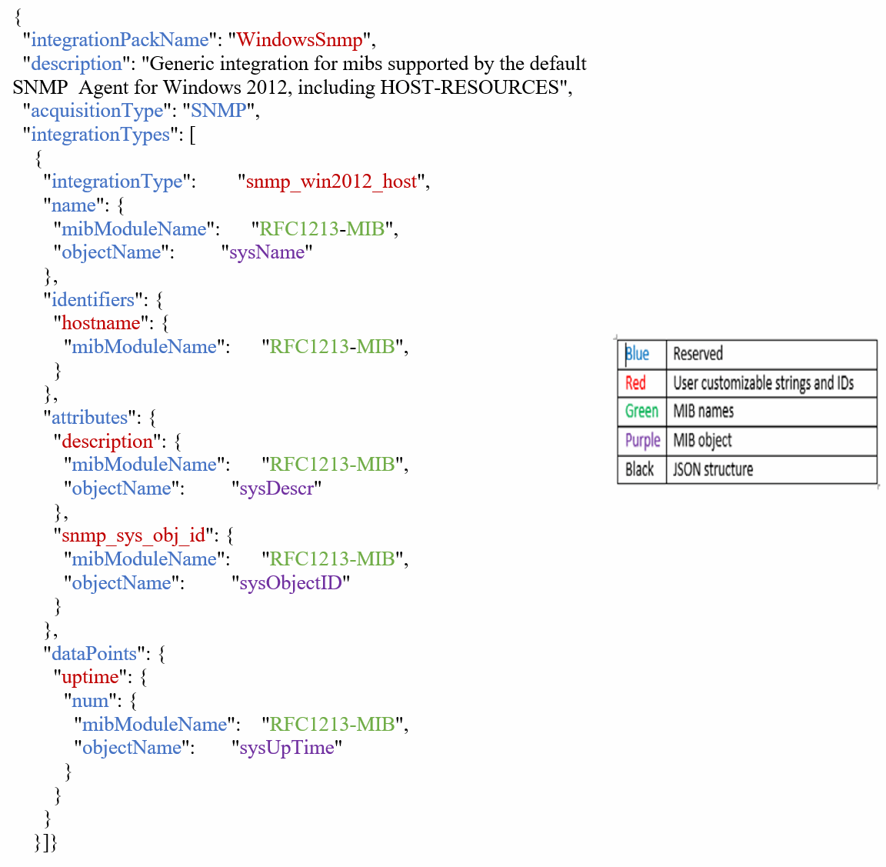
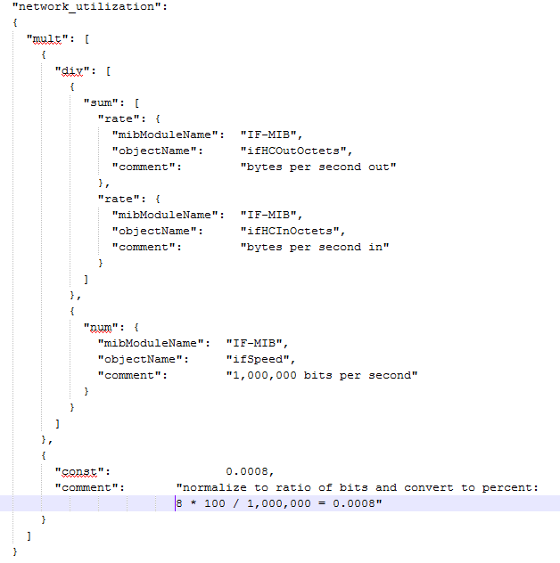

= Integration。json檔案資訊
:allow-uri-read: 
:icons: font
:imagesdir: ../media/

[role="lead"]
積分.json檔案會識別有效負載。

下圖以色彩編碼呈現簡單的Integration .json檔案。隨附的表格會識別檔案中物件的功能。

== 關於Integration .json檔案

每個欄位都有下列特性：

* 「識別碼」區段形成獨特的複合金鑰、可在Insight中建立新的「物件」
* 「屬性」提供物件的中繼資料支援。
+
在這兩種情況下、只會保留該物件的最新報告值（由識別碼識別）。

* 「資料點」是時間序列資料、必須是數值。Insight會將此處報告的每個值保留90天（預設）、並將時間序列連結至識別的物件。

== 數字運算式

根據預設、所有的值運算式都會在整合有效負載中以字串形式報告。「識別碼」和「屬性」只能定義字串值。「資料點」可以定義字串或數值。數值是使用下列其中一個輔助按鍵來定義：

* 數字-自上次初始化計數器以來所接收的位元組總數
* 差異：在輪詢時間間隔內接收的位元組數
* 速率：在輪詢時間間隔內的平均接收速率（以每秒位元組為單位）
+
在輪詢時間間隔內、平均接收率（以百萬位元組/秒為單位）可透過速率和數學運算的組合來完成

== 數學運算

。 `integration.json` 檔案支援下列數學運算：加、減、乘、除。下列範例顯示Json檔案中的乘法、除和和運算。

== 關鍵字

實作的整合套件關鍵字字字字字串、是為了強制使用八位元字串衍生自八位元字串的八位元字串或專屬類型、而這些字串通常會以十六進位格式呈現、以作為ASCII字元呈現。

八位元組字串通常包含二進位資料、例如MAC位址和WWN：

[listing]
----
        "interface_mac": {
                  "mibModuleName":      "IF-MIB",
                  "objectName":         "ifPhysAddress"
                 }
----
ifPhysAddress是類型「物理位址」、只是一個八位元組字串：

[listing]
----
  PhysAddress ::= TEXTUAL-CONVENTION
                DISPLAY-HINT "1x:"
                STATUS       current
                DESCRIPTION
                                "Represents media- or physical-level addresses."
                SYNTAX       OCTET STRING
----
當ifPhysAddress預設呈現為hex時、結果如下：

[listing]
----
"interface_mac": "00:50:56:A2:07:E7"
----
不過、如果您有一個八位元字串或專屬類型、而該字串衍生自您想要解譯為Ascii的八位元字串、您可以使用「字串」關鍵字：

[listing]
----
        "string_test_1": {
          "string": {
            "mibModuleName":      "IF-MIB",
            "objectName":         "ifPhysAddress"
          }
        },

        "string_test_2": {
          "string": [
            {
              "mibModuleName":      "IF-MIB",
              "objectName":         "ifPhysAddress"
            },
            {
              "const": "JSD"
            },
            {
              "mibModuleName":      "IF-MIB",
              "objectName":         "ifPhysAddress"
            }
          ]
        }
----
關鍵字會遵循現有的字串連規則、在下列範例中的字詞之間插入一個空格：

[listing]
----
      "string_test_1": "PV¢ç",
              "string_test_2": "PV¢ç JSD PV¢ç"
----
「字串」關鍵字會在單一字詞或字詞清單上作用、但不會在巢狀運算式上作用。只有資料點運算式才支援巢狀運算式。嘗試在datapoint運算式中使用「字串」運算式時、會產生類似下列的錯誤：

_java.lag.IllegalArgumentException：整合套件'GenericSwitch32'索引'sNMP_generic_interface_32'區段'dataPoints '機碼'tring_tet_3'不受支援的Json數值運算式'｛"string"：｛"mibModuleName"："if-mib"、"objectName"："ifPhysAddress｝｝'

某些衍生的字節字串類型（例如：DisplayString、SnmpAdminString）的優先順序高於"string"關鍵字。這是因為SnmpAdminString是專屬的UTF-8編碼、我們想要正確處理、而"string"關鍵字則會強制使用由SNMP架構傳回的預設字串表示、而該字串會假設每個字元具有單一位元組的Ascii程式碼點。
