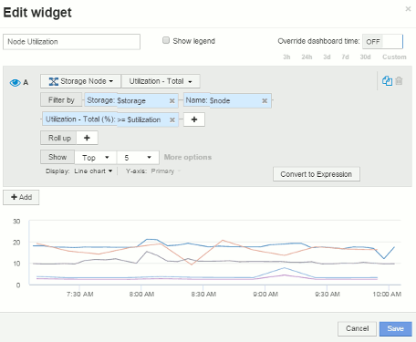
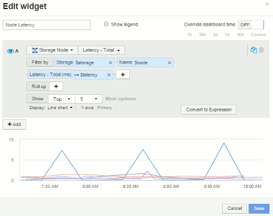
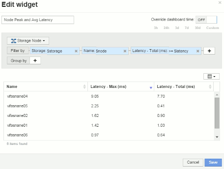
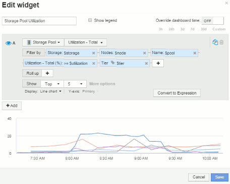
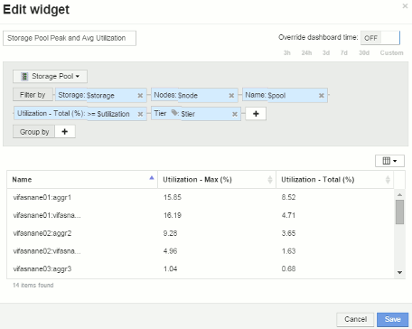
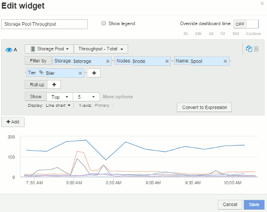
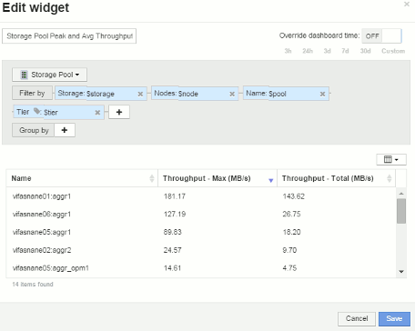
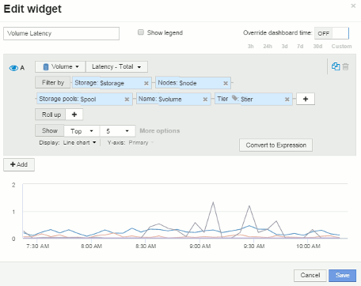
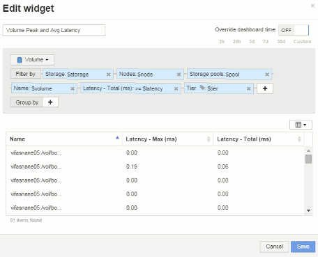
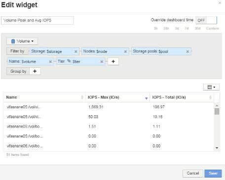

= 節點儀表板範例Widget設定
:allow-uri-read: 
:icons: font
:imagesdir: ../media/

[role="lead"]
節點儀表板的Widget設定、含變數範例。

以下是儲存節點儀表板範例中每個小工具的設定。

節點使用率：

 image:../media/nodeutiltable.gif[""]

節點延遲：

 

儲存資源池使用率：

 

儲存資源池處理量：

 

Volume延遲：

 

Volume IOPS：

image:../media/voliopschart.gif[""] 
