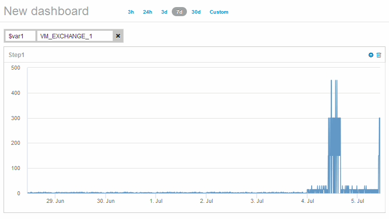

= 觀察物件隨時間變化的行為
:allow-uri-read: 
:icons: font
:imagesdir: ../media/

[role="lead"]
您可以觀察單一物件的行為、判斷物件是否在預期的作業層級內運作。

== 步驟

. 使用查詢來識別將成為分析主題的VM：* Query *>*+ New query*>* Virtual machine*>*"name"*
+
將名稱欄位保留空白會傳回所有VM。選取您要在此練習中使用的VM。您可以捲動VM清單來選取它。

. 針對您要收集的資訊建立新的儀表板。在工具列中、按一下*儀表板*>*+新儀表板*。
. 在新的儀表板中、選取*變數*>*文字*。
+
.. 將查詢中的VM名稱新增為``$var1`` 價值。
.. 按一下核取方塊。

+
此變數可用於在您要分析的不同物件集之間輕鬆切換。在分析的其他步驟中、您可以重複使用此變數、針對最初選擇的單一VM進行額外分析。在識別多個物件時、變數會變得更有用。

. 新增折線圖小工具至新儀表板：*小工具*>*折線圖*。
+
.. 將預設資產類型變更為虛擬機器：按一下「*虛擬機器*」>「*延遲-總計*」。
.. 按一下*篩選條件*>*名稱*>*$var1*。
.. 變更儀表板上的時間週期：*置換儀表板時間*>*開啟*>* 7天*。

+
您可以使用任何預設選項或指定自訂時間範圍來變更顯示的持續時間。

+
+儀表板會在您指定的時間段內顯示VM的* IOPS總計*。

. 為小工具指派名稱並儲存小工具。

== 結果

您的小工具應包含類似下列內容的資料： 

虛擬機器在顯示的7天內、顯示一段短時間內異常高的延遲時間。
