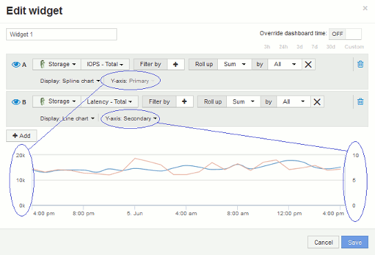

= 主要軸和次要軸說明
:allow-uri-read: 
:icons: font
:imagesdir: ../media/

[role="lead"]
二線軸可讓您更輕鬆地檢視使用不同測量單位之兩組不同值的資料。

== 關於這項工作

不同的度量會針對圖表中所報告的資料、使用不同的度量單位。例如、當查看IOPS時、測量單位是每秒I/O作業次數（IO/s）、而延遲則純粹是時間測量（毫秒、微秒、秒等）。在單一折線圖上使用單一Y軸設定值來記錄這兩個指標時、延遲數（通常是幾毫秒）會以相同的IOPS（通常以千位數為單位）記錄、而延遲線會以該比例消失。

但是、您可以在單一有意義的圖表上、將一組測量單位設定在主要（左側）Y軸上、另一組測量單位設定在次要（右側）Y軸上、藉此將這兩組資料記錄在圖表上。每個指標都會以自己的比例製表。

== 步驟

. 建立或開啟儀表板。將*折線圖*、*不規則曲線圖*、*區域圖*或*堆疊區域圖*小工具新增至儀表板。
. 選取資產類型（例如* Storage *）、然後針對第一個度量選擇* IOPS -總計*。設定您喜歡的任何篩選條件、並視需要選擇彙總方法。
+
IOPS線會顯示在圖表上、其比例會顯示在左側。

. 按一下「*+新增*」將第二行新增至圖表。針對此行、請選擇*延遲-總計*作為度量。
+
請注意、折線會以平直的方式顯示在圖表底部。這是因為它的繪製規模與IOPS線相同。

. 在「延遲」查詢中、選取「* Y軸：二線*」。
+
延遲線現在會以自己的比例繪製、顯示在圖表右側。

+

