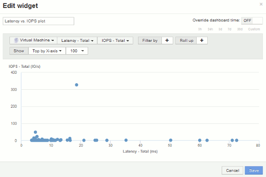
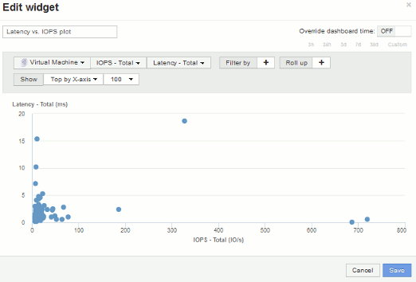

= Scatter繪圖 範例：瞭解您的軸
:allow-uri-read: 
:icons: font
:imagesdir: ../media/

[role="lead"]
變更Scatterpl繪圖 小工具中的計數器順序、會變更顯示資料的軸。

== 關於這項工作

此範例將建立散佈圖、讓您看到效能不佳的VM、其延遲比低IOPS高。

== 步驟

. 以編輯模式建立或開啟儀表板、並新增*散點繪圖圖表*小工具。
. 選取資產類型、例如*虛擬機器*。
. 選取您要繪製的第一個計數器。在此範例中、選取*延遲-總計*。
+
_延遲-總計_是以圖表的X軸製表。

. 選取您要繪製的第二個計數器。在此範例中、選取* IOPS -總計*。
+
_IOPS -總計_是根據圖表中的Y軸製表。延遲較高的VM會顯示在圖表的右側。只會顯示前100大延遲虛擬機器、因為*頂端依X軸*設定為目前設定。

+

. 現在將第一個計數器設定為* IOPS -總計*、第二個設為*延遲-總計*、即可反轉計數器的順序。
+
_目前圖表中的Y軸上已記錄_項目數量-總計_、以及_ IOPS - TOTa_l沿X軸。IOPS較高的虛擬機器現在會顯示在圖表的右側。

+
請注意、由於我們尚未變更*依X-Axis *排列的頂端*設定、因此Widget現在會顯示前100名最高IOPS的VM、因為這是目前沿X軸繪製的VM。

+

. 您可以選擇圖表以X軸顯示前N名、Y軸顯示前N名、X軸顯示下N名、Y軸顯示下N名。在最後一個範例中、圖表顯示前100大虛擬機器、其IOPS總計最高。如果我們依Y軸將其變更為TOP、則圖表將再次顯示前100大VM、其總延遲時間為_alsity_最高。
+
請注意、在較少繪圖的圖表中、您可以按一下某個點來開啟該資源的資產頁面。

