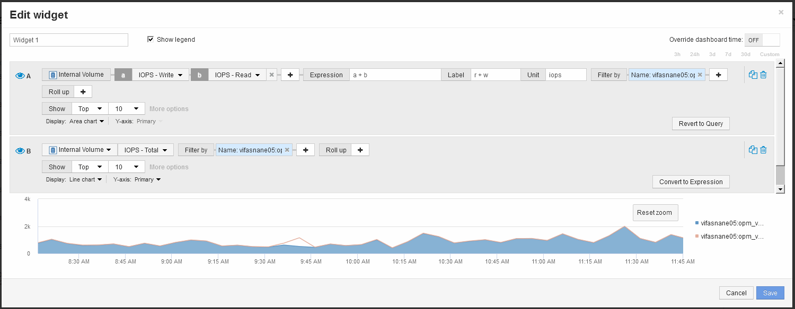

= 使用運算式來識別替代度量
:allow-uri-read: 
:icons: font
:imagesdir: ../media/

[role="lead"]
您可以使用運算式來檢視Web UI未提供的度量、例如產生系統負荷的IOPS。

== 關於這項工作

您可能想要使用運算式來顯示非讀取或非寫入作業所產生的總IOPS、例如內部磁碟區的例行作業。

== 步驟

. 將小工具新增至儀表板。選擇*區域圖*。
. 將預設裝置變更為「Internal Volume（內部磁碟區）」：按一下「* Storage *>* Internal Volume *（內部磁碟區）」>「* IOPS Write（* IOPS寫入）」
. 按一下*「轉換成運算式*」按鈕。
. 「* IOPS - Write *」（* IOPS -寫入*）指標現在位於字母變數欄位「'* a *」中。
. 在"`*b*’變數欄位中、按一下* Select *（選擇*）、然後選擇* IOPS - Read*（讀取*）。
. 在*運算式*欄位中、輸入* a + b*。在「*顯示*」區段中、選擇「*區域圖*」作為運算式。
. 在*篩選條件*欄位中、輸入您要分析的內部磁碟區名稱。
. 「*標籤*」欄位可識別運算式。將標籤變更為「R + W IOPS」等有意義的標籤。
. 按一下「**+Add**」、將IOPS總計行新增至小工具。
. 將預設裝置變更為「Internal Volume（內部磁碟區）」：按一下「* Storage *>* Internal Volume *（內部磁碟區）」>「* IOPS Total（IOPS總計）」*
. 在*篩選條件*欄位中、輸入您分析的內部磁碟區名稱。
+

+
圖表會以一行顯示總IOPS、並以藍色顯示讀寫IOPS的組合。9：30和9：45之間的落差顯示非讀取和非寫入IO（負荷）作業。

