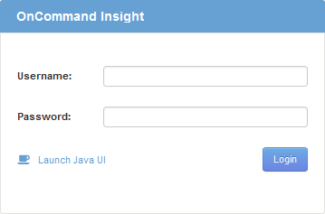

= 存取Web UI
:allow-uri-read: 
:icons: font
:imagesdir: ../media/

[role="lead"]
安裝OnCommand Insight 完支援後、您必須安裝授權、然後設定Insight來監控環境。若要這麼做、您可以使用網頁瀏覽器存取Insight Web UI。

== 步驟

. 執行下列其中一項：
+
** 在Insight伺服器上開啟Insight：
+
`+https://fqdn+`

** 從任何其他位置開啟Insight：
+
`+https://fqdn:port+`

+
連接埠號碼為443或安裝Insight伺服器時所設定的其他連接埠。如果您未在URL中指定連接埠號碼、則連接埠號碼預設為443。

+
將顯示「The」（還原）對話方塊OnCommand Insight ：

. 輸入您的使用者名稱和密碼、然後按一下*登入*。
+
如果已安裝授權、則會顯示資料來源設定頁面。

+
[NOTE]
====
不活動30分鐘的Insight瀏覽器工作階段會逾時、系統會自動將您登出系統。為了增加安全性、建議您在登出Insight後關閉瀏覽器。

====

