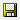

= 增加Cognos記憶體
:allow-uri-read: 
:icons: font
:imagesdir: ../media/

[role="lead"]
還原資料倉儲資料庫之前、您應該將Cognos的Java配置從768 MB增加到2048MB、以縮短報告產生時間。

== 步驟

. 以資料倉儲伺服器的系統管理員身分開啟命令提示字元視窗。
. 瀏覽至 `disk drive:\install directory\SANscreen\cognos\c10_64\bin64` 目錄。
. 輸入下列命令： `cogconfigw`
+
此時將顯示IBM Cognos Configuration（IBM Cognos組態）視窗。

+
[NOTE]
====
IBM Cognos組態捷徑應用程式指向 `disk drive:\Program Files\SANscreen\cognos\c10_64\bin64\cognosconfigw.bat`。如果Insight安裝在Program Files（間距）目錄中、這是預設目錄、而非ProgramFiles（無空間）、則會出現 `.bat` 檔案無法運作。如果發生這種情況、請以滑鼠右鍵按一下應用程式捷徑並進行變更 `cognosconfigw.bat` 至 `cognosconfig.exe` 以修正捷徑。

====
. 從左側的導覽窗格中、展開* Environment *、展開* IBM Cognos services *、然後按一下* IBM Cognos *。
. 選擇* TOMCAT的最大記憶體容量（MB*）、並將768 MB變更為2048MB。
. 在IBM Cognos組態工具列上、按一下 （儲存）。
+
系統會顯示一則資訊訊息、通知您Cognos正在執行的工作。

. 按一下 * 關閉 * 。
. 在IBM Cognos組態工具列上、按一下 （停止）。
. 在IBM Cognos組態工具列上、按一下 （開始）。

