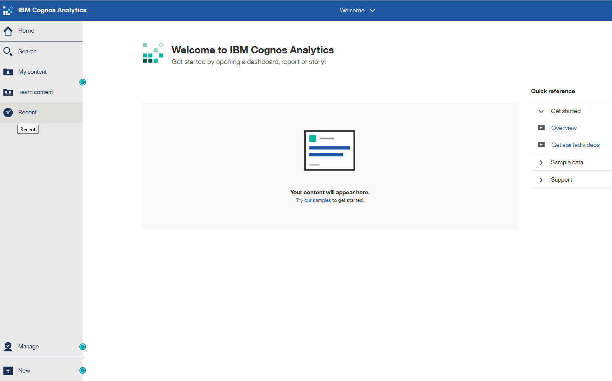

= 存取OnCommand Insight 《銷售報告入口網站
:allow-uri-read: 
:icons: font
:imagesdir: ../media/

[role="lead"]
您可以OnCommand Insight 直接從網頁瀏覽器、資料倉儲或從Insight伺服器存取《支援不整報告入口網站》。您可以使用報告入口網站存取預先定義的報告、或使用資料倉儲資料建立自己的報告。

== 從網頁瀏覽器存取報告入口網站

=== 步驟

. 開啟網頁瀏覽器。
. 輸入下列URL： `+https://server-name:9300/bi+`
+
9300代表安裝期間指定的預設連接埠。如果指定了其他連接埠、則必須變更連接埠。

. 輸入您的使用者名稱和密碼、然後按一下「*確定*」。

== 從Insight伺服器存取報告入口網站

=== 步驟

. 開啟網頁瀏覽器。
. 輸入下列URL以存取Insight伺服器： `+https://server-name+`
. 輸入您的使用者名稱和密碼、然後按一下「*確定*」。
. 在Insight工具列中、按一下 image:../media/oci-reporting-portal-icon.gif[""]。
. 在顯示的登入頁面中、輸入您的使用者名稱和密碼、然後按一下*確定*。

== 從資料倉儲存取報告入口網站

=== 步驟

. 開啟網頁瀏覽器。
. 輸入下列URL以存取資料倉儲： `+https://server-name/dwh+`
. 輸入您的使用者名稱和密碼、然後按一下「*確定*」。
. 在資料倉儲工具列中、按一下 image:../media/oci-reporting-portal-icon.gif[""]。
. 在顯示的登入頁面中、輸入您的使用者名稱和密碼、然後按一下*確定*。

=== 結果

隨即顯示IBM Cognos Analytics歡迎頁面。這是OnCommand Insight 「資訊不整合報告入口網站」的預設登陸頁面。

