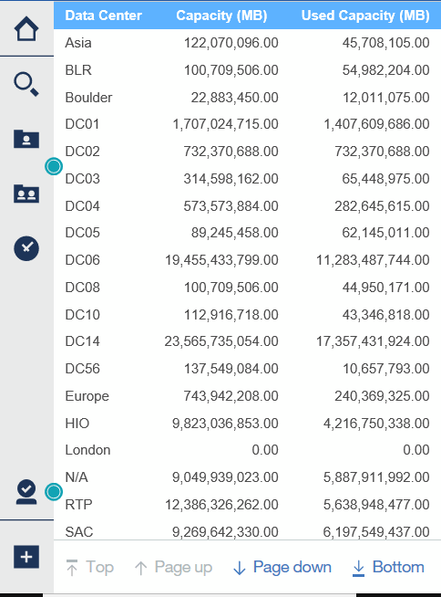

= 使用Cognos 11建立報告
:allow-uri-read: 
:icons: font
:imagesdir: ../media/

[role="lead"]
使用Cognos 11建立報告與舊版Cognos不同。請使用此程序、使用預先定義OnCommand Insight 的功能表建立報告。

== 關於這項工作

請使用下列步驟、針對多個資料中心的儲存與儲存資源池實體容量、產生簡單的報告。

== 步驟

. 在工具列中、按一下 image:../media/new-report.gif[""]
. 按一下*報告*
. 按一下「*範本*」>「*空白*」
. 按一下*主題*>*酷藍*>*確定*
+
隨即顯示來源和資料索引標籤

. 按一下*來源*>*image:../media/new-report.gif[""]*
. 在「開啟檔案」對話方塊中、按一下「*團隊內容*」>「*套件*」
+
此時會顯示可用套件的清單。

. 按一下*儲存與儲存資源池容量*>*開啟*
. 按一下 image:../media/new-report.gif[""]
+
隨即顯示報告的可用樣式。

. 按一下*清單*
+
新增適當的清單和查詢名稱

. 按一下「*確定*」
. 展開*實體容量*
. 擴充至*資料中心*的最低層級
. 拖曳  報告內容。
. 展開*容量（MB）*
. 將*容量（MB）*拖曳到報告上。
. 將*已用容量（MB）*拖曳到報告上。
. 按一下以執行報告 image:../media/run-report.gif[""] 並選擇輸出類型。

== 結果

系統會建立類似下列內容的報告：

