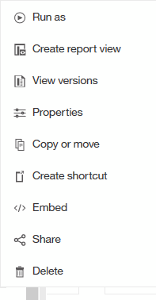
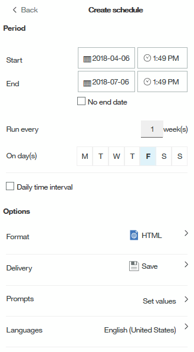

= 自訂報告的輸出格式與交付
:allow-uri-read: 
:icons: font
:imagesdir: ../media/

[role="lead"]
您可以自訂報告的格式和交付方法。

== 步驟

. 開啟OnCommand Insight 「The RizeReport Portal」、選取您要自訂的報告、然後按一下「*」*。
+

. 按一下*內容*>*排程*
+

. 您可以設定下列選項：
+
** *排程*您想要執行報告的時間。
** *格式*報告輸出。
** *交付*列印、儲存或以電子郵件寄送報告。
** *語言*定義報告的交付語言。

. 按一下*「Create」（建立）*以使用您所做的選擇來產生報告。

