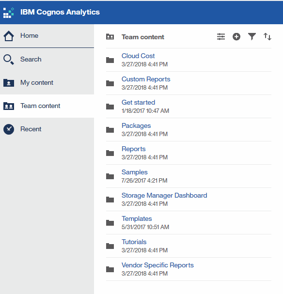

= 瀏覽至預先定義OnCommand Insight 的等化報告
:allow-uri-read: 
:icons: font
:imagesdir: ../media/

[role="lead"]
當您開啟報告入口網站時、團隊內容資料夾是您選擇OnCommand Insight 所需資訊類型的起點。

== 步驟

. 在左側導覽窗格中、按一下*團隊內容*、然後選取您要使用的資訊類別。
+

. 按一下「*報告*」以存取預先定義的報告。
. 按一下*入門*、*範例*或*教學課程*、即可瞭解如何建立報告。

